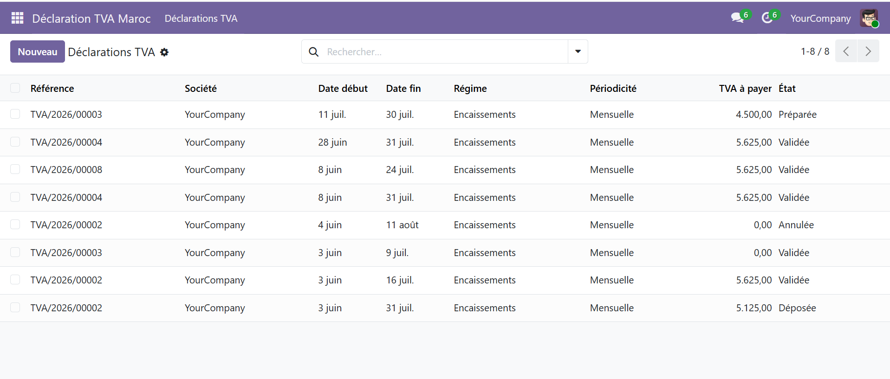
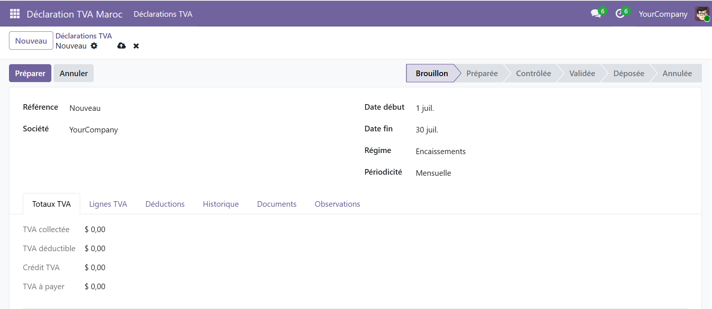
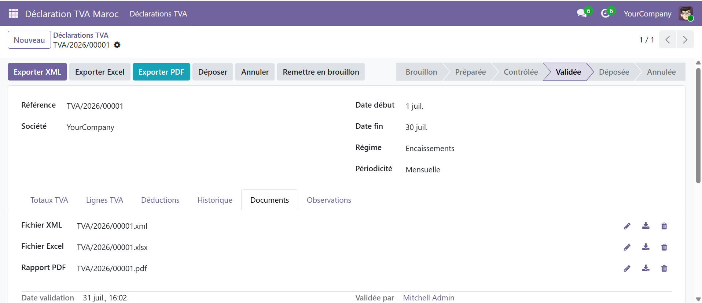
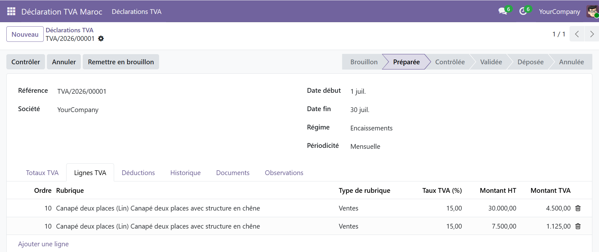
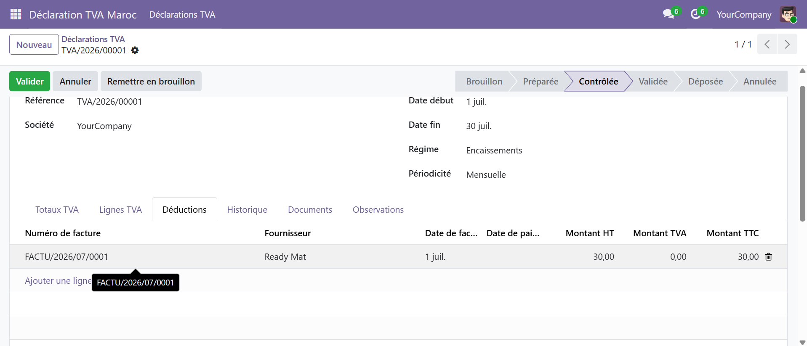
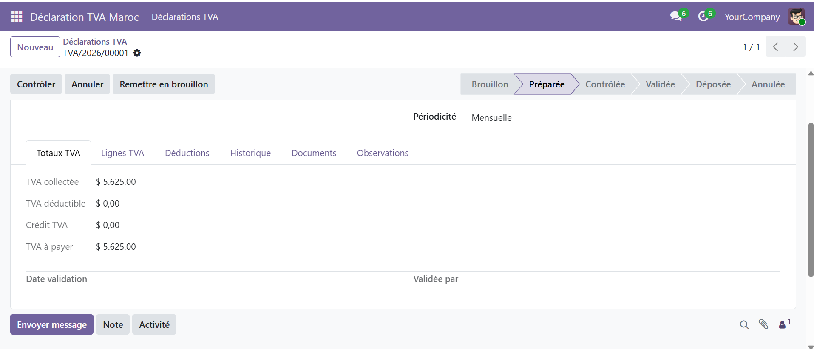
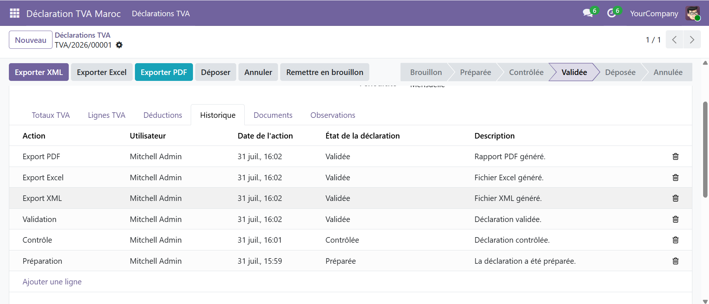
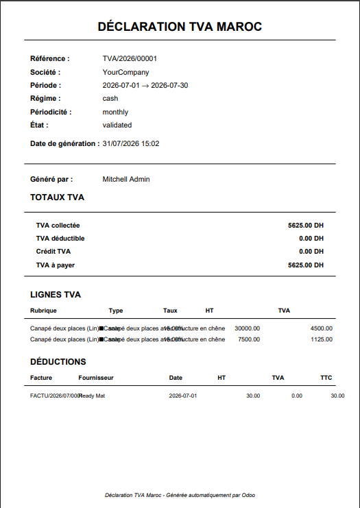
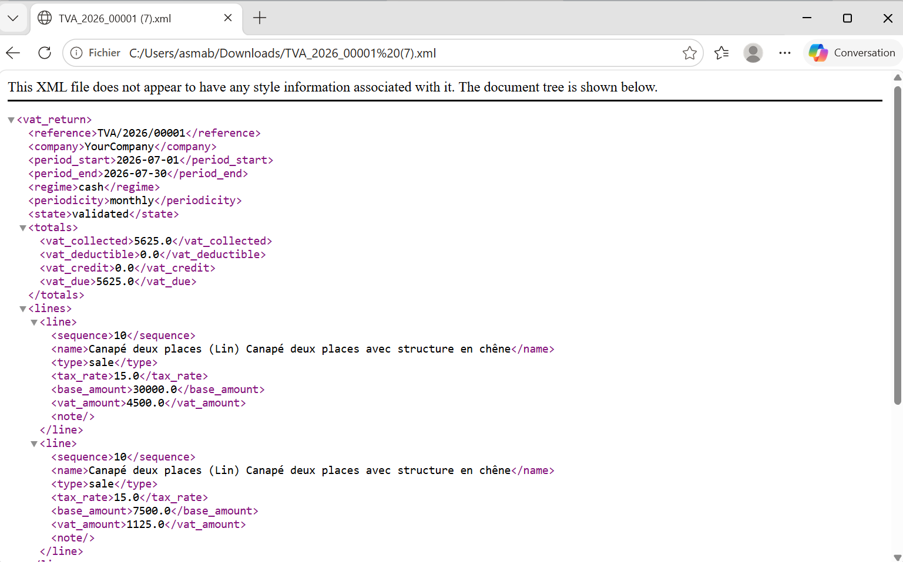

# 🇲🇦 Module Odoo – Déclaration TVA Maroc

## Présentation

Ce projet est un module personnalisé développé sous **Odoo 19** dans le cadre d'un projet de stage.

L'objectif du module est de simplifier et d'automatiser le processus de préparation des déclarations de TVA marocaine en exploitant directement les données comptables enregistrées dans Odoo.

Le module permet de récupérer automatiquement les factures clients et fournisseurs, de calculer les montants de TVA, de gérer le cycle complet de validation d'une déclaration et de générer plusieurs formats d'export (PDF, Excel et XML).

---

# Objectifs du projet

Les principaux objectifs de ce module sont :

- Automatiser la préparation des déclarations de TVA.
- Réduire les erreurs de saisie manuelle.
- Centraliser toutes les informations fiscales dans Odoo.
- Faciliter le contrôle des montants de TVA.
- Générer différents documents destinés au suivi et à l'archivage.
- Offrir une base pouvant être adaptée au format XML officiel de la plateforme SIMPL.

---

# Fonctionnalités principales

## Gestion des déclarations

- Création d'une nouvelle déclaration de TVA.
- Sélection de la société.
- Sélection de la période fiscale.
- Gestion de plusieurs déclarations.

---

## Préparation automatique

Lors de la préparation de la déclaration, le module :

- recherche automatiquement les factures clients publiées ;
- recherche automatiquement les factures fournisseurs publiées ;
- récupère les lignes contenant de la TVA ;
- génère automatiquement les lignes de déclaration ;
- génère automatiquement le relevé des déductions.

---

## Calcul automatique de la TVA

Le module calcule automatiquement :

- TVA collectée
- TVA déductible
- Crédit TVA
- TVA nette à payer

Les calculs sont mis à jour automatiquement après chaque préparation.

---

## Workflow de validation

Une déclaration passe par plusieurs états :

- Brouillon
- Préparée
- Contrôlée
- Validée
- Déposée
- Annulée

Chaque changement d'état est enregistré dans l'historique.

---

## Historique

Le module conserve un historique des opérations réalisées :

- Création
- Préparation
- Contrôle
- Validation
- Dépôt
- Export PDF
- Export Excel
- Export XML
- Annulation

Chaque action est associée :

- à l'utilisateur
- à la date
- à un commentaire

---

## Exports disponibles

Le module permet de générer :

### Export PDF

Le rapport PDF contient notamment :

- les informations générales de la déclaration ;
- les montants de TVA ;
- les lignes TVA ;
- les déductions ;
- les informations de génération.

---

### Export Excel

Le fichier Excel contient :

- les informations générales ;
- les montants calculés ;
- les lignes TVA ;
- les déductions.

---

### Export XML

Le module génère également un fichier XML contenant les informations de la déclaration.

Cette version constitue une base pouvant être adaptée au format officiel demandé par l'administration fiscale marocaine.

---

# Architecture du projet

```
l10n_ma_vat_simpl
│
├── models
│   ├── vat_return.py
│   ├── vat_return_line.py
│   ├── vat_deduction_line.py
│   ├── vat_history.py
│   ├── res_company.py
│   └── res_partner.py
│
├── views
│
├── security
│
├── data
│
├── wizard
│
├── report
│
├── static
│
├── __manifest__.py
│
└── README.md
```

---

# Technologies utilisées

- Python 3
- Odoo 19
- PostgreSQL
- XML
- ReportLab
- OpenPyXL
- Git
- GitHub
- Ubuntu (WSL2)
- Visual Studio Code

---

# Installation

1. Cloner le dépôt GitHub.

2. Copier le module dans :

```
custom_addons/
```

3. Redémarrer Odoo.

4. Mettre à jour la liste des applications.

5. Installer le module **Déclaration TVA Maroc**.

---

# Démonstration

Le scénario de démonstration est le suivant :

1. Création d'une déclaration.
2. Sélection de la période.
3. Préparation automatique.
4. Vérification des lignes TVA.
5. Vérification des déductions.
6. Calcul automatique des montants.
7. Contrôle.
8. Validation.
9. Génération du PDF.
10. Génération du fichier Excel.
11. Génération du fichier XML.
12. Dépôt de la déclaration.

---

## Liste des déclarations

La liste des déclarations permet de consulter les déclarations de TVA créées ainsi que leur période, leur société et leur état.



---

## Formulaire de déclaration

Le formulaire permet de créer et de gérer une déclaration de TVA en renseignant notamment la société, la période fiscale, le régime et la périodicité.



---

## Documents comptables

Cette interface permet de consulter les documents comptables pris en compte lors de la préparation de la déclaration.



---

## Lignes de TVA

Les lignes de TVA générées automatiquement à partir des factures sont affichées dans cette interface.



---

## Déductions

Le module génère automatiquement le relevé des déductions à partir des factures fournisseurs concernées.



---

## Totaux de TVA

Les montants calculés automatiquement sont présentés dans la déclaration : TVA collectée, TVA déductible, crédit de TVA et TVA nette à payer.



---

## Historique

L'historique permet de suivre les différentes opérations effectuées sur une déclaration, avec l'utilisateur, la date et l'action réalisée.



---

## Export PDF

Le module permet de générer un document PDF contenant les informations et les résultats de la déclaration de TVA.



---

## Export XML

Le module permet également de générer un fichier XML contenant les données de la déclaration.



---

# Améliorations futures

Le projet peut être enrichi par :

- l'intégration du format XML officiel SIMPL ;
- l'ajout de contrôles fiscaux supplémentaires ;
- la gestion des régularisations ;
- des tableaux de bord statistiques ;
- des graphiques de suivi de TVA ;
- des notifications automatiques.

---

# Auteur

**Asma Bari**

Étudiante en Génie Informatique

Spécialité : Développement Logiciel et Applicatif (DLA)

École Nationale des Sciences Appliquées d'Agadir (ENSA Agadir)

---